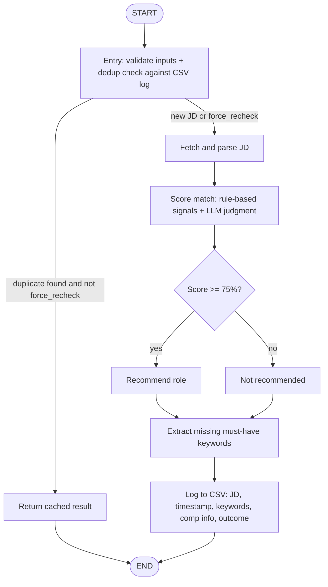

# HireGraph

A LangGraph-based pipeline that checks how well a candidate's resume matches a specific job posting, and tells them what's missing.

## Pipeline (planned)

Input is a candidate profile (resume text, plus `location` and approximate `role` as filters), a link to one job description, and a `force_recheck` flag to bypass the dedup check. Every JD checked gets logged to a CSV (JD, timestamp, extracted keywords, comp info if present, match outcome) — the entry node uses that log to skip re-scoring a JD it's already seen, unless `force_recheck` is set.

This is the first slice of a larger scope — see `PROJECT_PLAN.md` for the full multi-candidate, bias-detection, and ranking curriculum this is building toward, and `instructions.md` for how this project is meant to be worked on (teaching mode, progress log).

## Stack

Python, LangGraph, LLM APIs (local via LM Studio during development).
